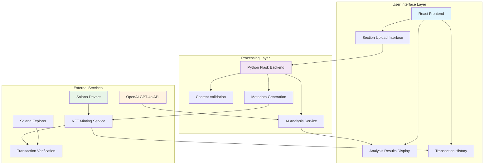
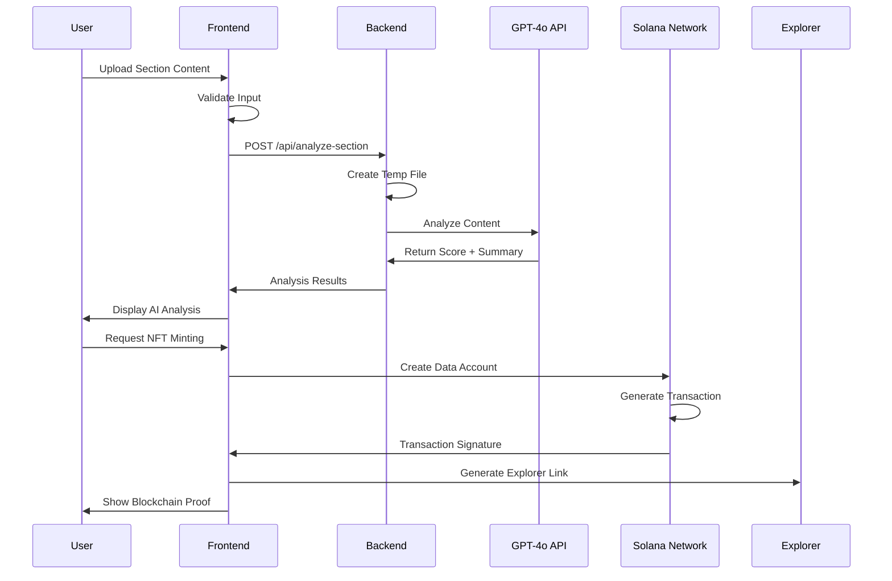
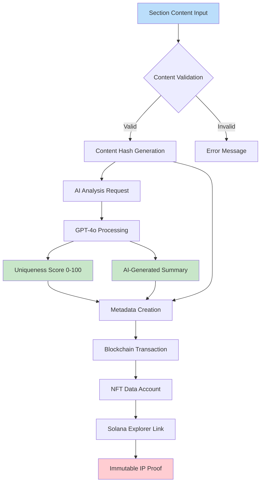
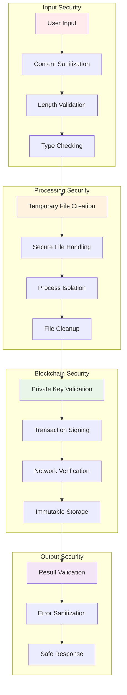
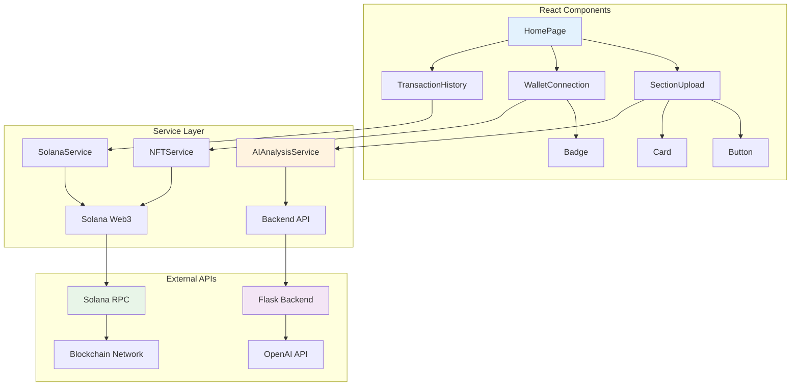

#FLOWCHART.md
# Solana IP Protector - System Flowcharts

## 1. High-Level System Architecture

## 2. Information Flow Diagram

## 3. Data Processing Pipeline

## 4. Security & Validation Flow

## 5. Component Interaction Diagram

