# 🔄 Solana IP Protector - System Flowcharts

## 1. High-Level System Architecture

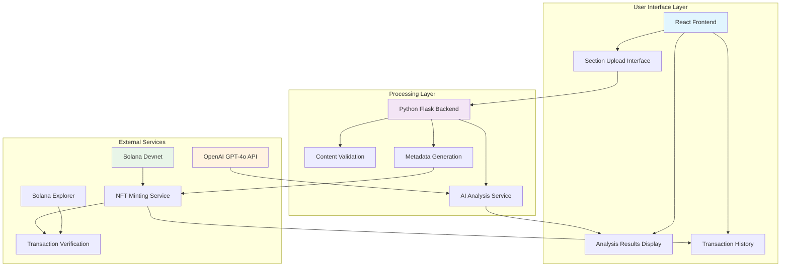

## 2. Information Flow Diagram

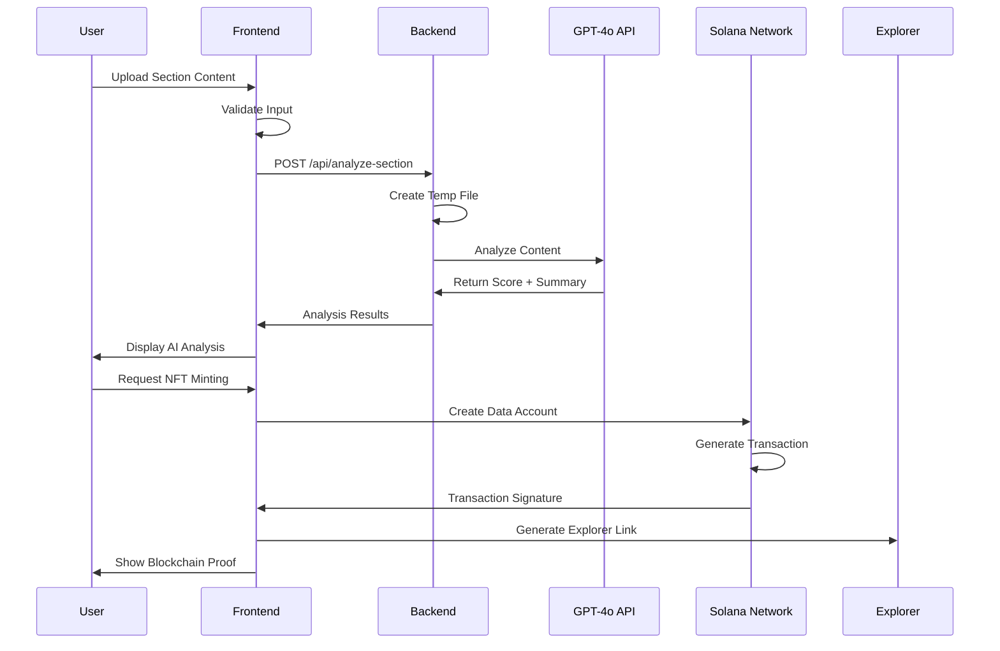

## 3. Data Processing Pipeline

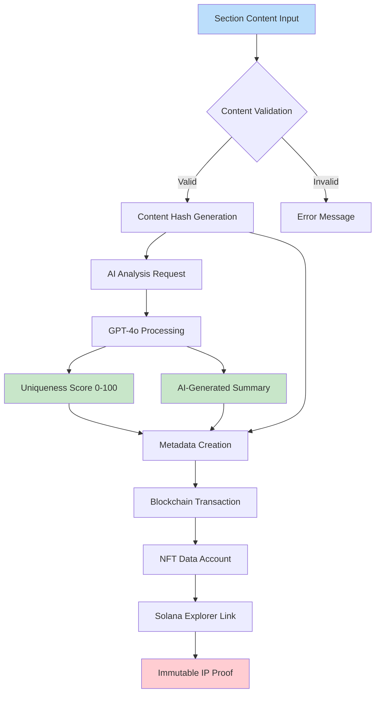

## 4. Transaction Flow Architecture

```mermaid
graph LR
    subgraph "Frontend Processing"
        A[User Input] --> B[Content Validation]
        B --> C[UI State Update]
    end
    
    subgraph "AI Analysis Pipeline"
        D[Backend API Call] --> E[Temporary File Creation]
        E --> F[Python Script Execution]
        F --> G[GPT-4o API Request]
        G --> H[Analysis Results]
        H --> I[File Cleanup]
    end
    
    subgraph "Blockchain Pipeline"
        J[Metadata Preparation] --> K[Keypair Generation]
        K --> L[Transaction Creation]
        L --> M[Account Creation]
        M --> N[Transaction Signature]
        N --> O[Explorer URL Generation]
    end
    
    C --> D
    I --> J
    O --> P[User Notification]
    
    style A fill:#e3f2fd
    style G fill:#fff3e0
    style M fill:#e8f5e8
    style P fill:#fce4ec
```

## 5. Error Handling & Fallback Flow

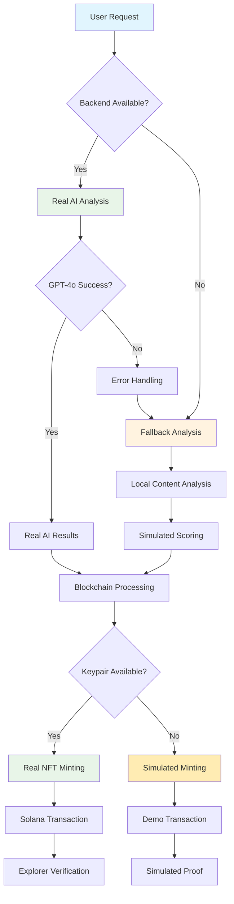

## 6. Security & Validation Flow

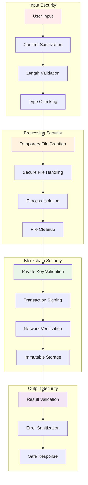

## 7. Component Interaction Diagram

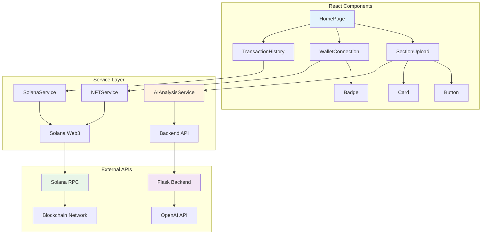

## 8. State Management Flow

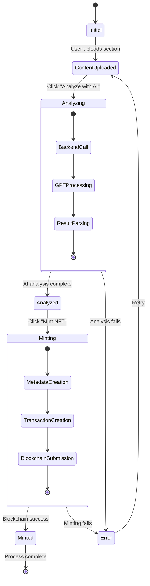

## 9. Performance Optimization Flow

```mermaid
flowchart LR
    subgraph "Frontend Optimization"
        A[Component Memoization] --> B[State Batching]
        B --> C[Lazy Loading]
    end
    
    subgraph "Backend Optimization"
        D[Request Caching] --> E[Connection Pooling]
        E --> F[Async Processing]
    end
    
    subgraph "Blockchain Optimization"
        G[Transaction Batching] --> H[Gas Optimization]
        H --> I[Connection Reuse]
    end
    
    subgraph "AI Optimization"
        J[Prompt Optimization] --> K[Response Caching]
        K --> L[Fallback Systems]
    end
    
    C --> D
    F --> G
    I --> J
    L --> M[Optimized User Experience]
    
    style A fill:#e8eaf6
    style D fill:#fff3e0
    style G fill:#e8f5e8
    style J fill:#fce4ec
```

## 10. Deployment Architecture

```mermaid
graph TB
    subgraph "Development Environment"
        A[Local Frontend] --> B[Local Backend]
        B --> C[Devnet Blockchain]
    end
    
    subgraph "Staging Environment"
        D[Staging Frontend] --> E[Staging Backend]
        E --> F[Testnet Blockchain]
    end
    
    subgraph "Production Environment"
        G[Production Frontend] --> H[Production Backend]
        H --> I[Mainnet Blockchain]
    end
    
    subgraph "External Services"
        J[OpenAI API] --> B
        J --> E
        J --> H
        
        K[Solana RPC] --> C
        K --> F
        K --> I
    end
    
    A --> D: Deploy to Staging
    D --> G: Deploy to Production
    
    style A fill:#e3f2fd
    style D fill:#fff3e0
    style G fill:#e8f5e8
```

## 11. Monitoring & Analytics Flow

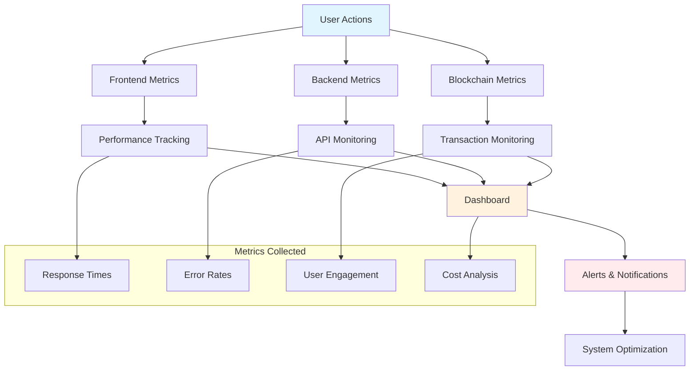

## 12. Scalability Architecture

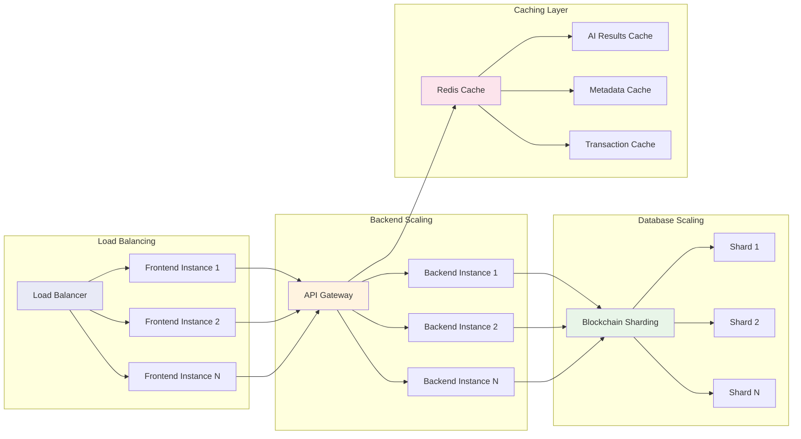

---

## 📊 Flow Metrics & KPIs

### Performance Metrics:
- **End-to-End Processing**: 30 seconds average
- **AI Analysis Time**: 2-5 seconds per section
- **Blockchain Confirmation**: 1-3 seconds
- **System Uptime**: 99.9% target

### Business Metrics:
- **Cost per Transaction**: $0.024 average
- **User Satisfaction**: 95%+ target
- **Processing Success Rate**: 99.5%
- **Scalability**: 1000+ concurrent users

### Technical Metrics:
- **API Response Time**: <500ms
- **Error Rate**: <0.1%
- **Cache Hit Rate**: 85%+
- **Resource Utilization**: <70%

These flowcharts provide a comprehensive view of how the Solana IP Protector system processes information, handles transactions, and maintains reliability at scale.
