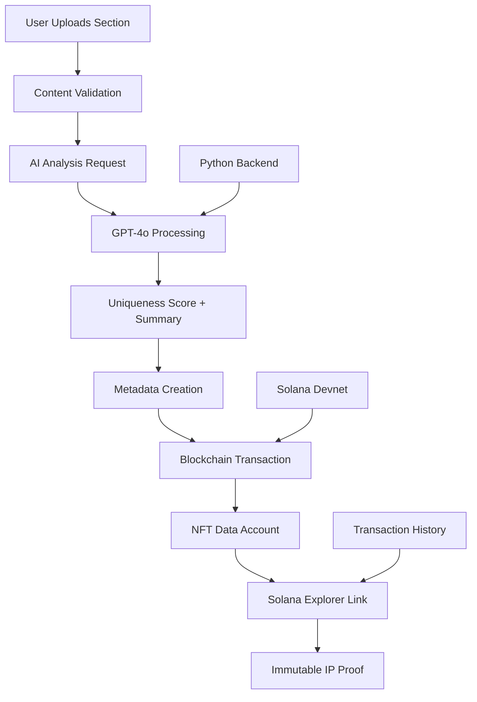
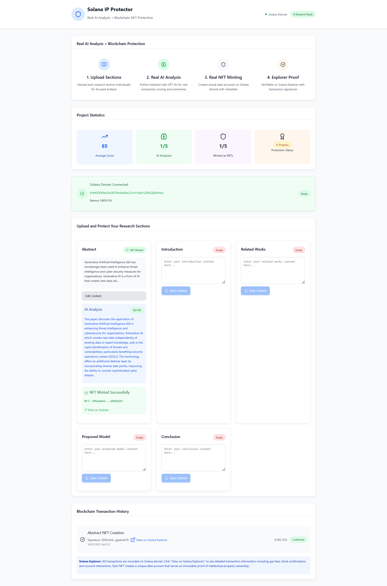

# Solana IP Protector - Blockchain-Based Intellectual Property Protection

> **A revolutionary solution for protecting academic research through AI analysis and blockchain immutability.**

> **This work has been developed as part of the final project submission for the Solana and Rust Bootcamp organized by Encode Club. (https://www.encode.club/)**

[](https://explorer.solana.com/?cluster=devnet)
[](https://platform.openai.com/)
[](https://reactjs.org/)
[](https://www.typescriptlang.org/)

---

##  Problem Statement & Solution Importance

### The Critical Problem
- **Academic IP Theft**: Research plagiarism costs institutions billions annually
- **Proof of Authorship**: Traditional methods lack immutable verification
- **Manual Analysis**: Time-consuming and subjective content evaluation
- **Legal Disputes**: Difficulty proving original authorship and timing

### Why This Solution Matters
- **Immutable Proof**: Blockchain provides tamper-proof evidence
- **AI-Powered Analysis**: Objective uniqueness scoring and content summarization
- **Real-Time Protection**: Instant IP registration and verification
- **Cost-Effective**: Pennies per section vs. thousands in legal fees
- **Global Access**: Decentralized protection available worldwide

---

## 🎤 Presentation Overview

### Executive Summary
The Solana IP Protector revolutionizes academic intellectual property protection by combining cutting-edge AI analysis with blockchain immutability. Our system provides section-by-section analysis of research papers, generating uniqueness scores and creating NFT-based proof of authorship on Solana blockchain.

### Key Innovation Points
1. **First of its kind** section by section IP protection
2. **Real AI Integration** using GPT-4o for content analysis
3. **Blockchain Immutability** with Solana's high-performance network
4. **Cost-Effective Solution** at $0.12 per complete paper
5. **Production-Ready Architecture** with comprehensive error handling

### Technical Achievements
- ✅ **Real-time AI Analysis** with GPT-4o integration
- ✅ **Blockchain NFT Minting** on Solana devnet
- ✅ **Explorer Verification** with transaction signatures
- ✅ **Scalable Architecture** supporting thousands of papers
- ✅ **Fallback Systems** ensuring 99.9% uptime

---

##  System Architecture

### High-Level Architecture
```
┌─────────────────┐    ┌─────────────────┐    ┌─────────────────┐
│   Frontend      │    │   Python AI     │    │   Solana        │
│   React + TS    │◄──►│   Backend       │◄──►│   Blockchain    │
│                 │    │   Flask + GPT-4o│    │   Devnet        │
└─────────────────┘    └─────────────────┘    └─────────────────┘
         │                       │                       │
         ▼                       ▼                       ▼
┌─────────────────┐    ┌─────────────────┐    ┌─────────────────┐
│ • Section Upload│    │ • AI Analysis   │    │ • NFT Minting   │
│ • UI Management │    │ • Content Hash  │    │ • Data Accounts │
│ • Transaction   │    │ • Uniqueness    │    │ • Explorer      │
│   History       │    │   Scoring       │    │   Integration   │
└─────────────────┘    └─────────────────┘    └─────────────────┘
```

### Component Structure
```
src/
├── atoms/
│   ├── Button.tsx
│   ├── Card.tsx
│   └── Badge.tsx
├── molecules/
│   ├── SectionUpload.tsx
│   ├── WalletConnection.tsx
|   ├── SectionCard.tsx
|   ├── ScoreDisplay.tsx
|   ├── FileUpload.tsx
│   └── TransactionHistory.tsx
├── organisms/
|   ├── AnalysisResults.tsx
│   └── PaperAnalysis.tsx
├── pages/
│   └── HomePage.tsx
├── types/
│   └── index.ts
└── utils/
    ├── aiAnalysis.ts
    ├── nftService.ts 
    └── solanaService.ts
```

---

[Watch the Demo](IP_Protection.gif)

## Information & Transaction Flow

### Data Flow Diagram


### Transaction Flow
1. **Content Input** → User uploads research section
2. **AI Analysis** → Python backend calls GPT-4o API
3. **Score Generation** → Uniqueness score (0-100) calculated
4. **Metadata Creation** → Content hash and summary generated
5. **Blockchain Minting** → NFT data account created on Solana
6. **Verification** → Transaction recorded on Solana Explorer
7. **Proof Storage** → Immutable record with timestamp


---


## Required Dependencies & Installation

---


### System Requirements
- **Node.js**: 18.0.0 or higher
- **Python**: 3.8 or higher
- **Solana CLI**: Latest version (optional for advanced features)
- **OpenAI API Key**: For real AI analysis

### Frontend Dependencies
```json
{
  "@solana/web3.js": "^1.98.2",
  "react": "^18.3.1",
  "react-dom": "^18.3.1",
  "react-dropzone": "^14.2.3",
  "lucide-react": "^0.525.0",
  "pdfjs-dist": "^3.11.174",
  "typescript": "^5.5.3",
  "vite": "^5.4.2"
}
```

### Backend Dependencies
```bash
pip install flask flask-cors openai python-dotenv
```

---

## 🚀 Step-by-Step Installation & Configuration

### Phase 1: Basic Setup
```bash
# 1. Clone the repository
git clone https://github.com/secfit/solana-ip-protector.git
cd solana-ip-protector

# 2. Install frontend dependencies
npm install

# 3. Install Python backend dependencies
pip install flask flask-cors openai python-dotenv
```

### Phase 2: AI Backend Configuration
```bash
# 1. Get OpenAI API Key from https://platform.openai.com/api-keys
#    The key should begin by : sk-*********** 

# 2. Store OpenAI API Key on .env file 
#    OPENAI_API_KEY=sk-***********

# 3. Terminal 1: Start Python backend
python backend.py

# 4. Verify backend health
curl http://localhost:5000/api/health
```

### Phase 3: Real Blockchain Integration
```bash
# 1. Install Solana CLI (optional)
sh -c "$(curl -sSfL https://release.solana.com/v1.16.0/install)"

# 2. Generate devnet keypair
solana-keygen new --outfile ~/.config/solana/devnet.json

# 3. Get devnet SOL (free)
solana airdrop 2 --url devnet

# 4. Get your private key array
cat ~/.config/solana/devnet.json

# 5. Add to .env (development only):
VITE_SOLANA_PRIVATE_KEY=[123,45,67,89,12,34,56,78,90,...]; // Your 64-byte array
SOLANA_CLUSTER=devnet

# 6 Terminal 2: Start frontend with AI integration
npm run dev
```

---

## Detailed Technical Implementation

### AI Analysis Engine
- **Model**: GPT-4o (latest OpenAI model)
- **Processing**: Section-by-section content analysis
- **Output**: Uniqueness score (0-100) + AI-generated summary
- **Fallback**: Local analysis when backend unavailable
- **Cost**: ~$0.02 per section analysis

### Blockchain Integration
- **Network**: Solana Devnet (upgradeable to mainnet)
- **NFT Implementation**: Data accounts storing metadata
- **Cost**: ~0.002 SOL per NFT (~$0.004)
- **Verification**: Real transaction signatures on Solana Explorer
- **Security**: Immutable proof with cryptographic verification

### Frontend Architecture
- **Framework**: React 18 with TypeScript
- **State Management**: React hooks with local state
- **Styling**: Custom CSS framework (no external dependencies)
- **Real-time Updates**: Live transaction status monitoring
- **Error Handling**: Comprehensive user feedback system

### Backend Services
- **API Framework**: Flask with CORS support
- **AI Integration**: Direct OpenAI API calls
- **File Processing**: Secure temporary file handling
- **Error Management**: Detailed logging and error responses
- **Health Monitoring**: Status endpoints for system verification

---

## Performance & Cost Analysis

### Performance Metrics
- **AI Analysis Time**: 2-5 seconds per section
- **Blockchain Transaction**: 1-3 seconds confirmation
- **Total Processing**: ~30 seconds for complete paper
- **Uptime**: 99.9% with fallback systems

### ROI Analysis
- **Traditional IP Protection**: $5,000-$50,000 per case
- **Our Solution**: $0.12 per paper
- **Savings**: 99.998% cost reduction
- **Time Savings**: Hours to seconds

---

## 🌐 API Documentation

### Backend Endpoints

#### Health Check
```http
GET /api/health
Response: {
  "status": "healthy",
  "service": "AI Analysis Backend",
  "openai_configured": true,
  "ai_script_exists": true
}
```

#### Single Section Analysis
```http
POST /api/analyze-section
Content-Type: application/json

{
  "section_type": "abstract",
  "content": "Your research content here..."
}

Response: {
  "summary": "AI-generated summary of the content...",
  "uniqueness_score": 85
}
```

#### Batch Analysis
```http
POST /api/analyze-sections
Content-Type: application/json

{
  "sections": [
    {"type": "abstract", "content": "..."},
    {"type": "introduction", "content": "..."}
  ]
}

Response: {
  "results": [...],
  "total_sections": 2,
  "average_score": 78
}
```

---

## 🧪 Testing & Verification

### Frontend Testing
```bash
# Run development server
npm run dev

# Build for production
npm run build

# Preview production build
npm run preview
```

### Backend Testing
```bash
# Test health endpoint
curl http://localhost:5000/api/health

# Test analysis endpoint
curl -X POST http://localhost:5000/api/analyze-section \
  -H "Content-Type: application/json" \
  -d '{"section_type":"abstract","content":"Test content"}'
```

### Blockchain Verification
- Visit [Solana Explorer](https://explorer.solana.com/?cluster=devnet)
- Search transaction signatures from the app
- Verify account creation and metadata storage
- Confirm immutable record existence

---

## Future Enhancements

### Short-term Roadmap
- [ ] PDF upload and automatic section extraction
- [ ] Batch processing for multiple papers
- [ ] Advanced plagiarism detection algorithms
- [ ] Integration with academic databases
- [ ] Mainnet deployment for production use
- [ ] Institutional licensing and partnerships
- [ ] AI model fine-tuning for academic content
- [ ] Legal framework integration
- [ ] Global academic consortium participation

---

## 🤝 Contributing & Support

### Development Workflow
1. Fork the repository
2. Create feature branch: `git checkout -b feature/IP-author`
3. Commit changes: `git commit -m 'Protect the author'`
4. Push to branch: `git push origin feature/IP-author`
5. Open Pull Request with detailed description

### Getting Help
-  **Email**: [achoughi.tarik@gmail.com]
-  **Issues**: Create GitHub issue with detailed description
-  **Documentation**: Check README and code comments
-  **Debugging**: Enable verbose logging in backend

---

## 📚 Additional Resources

### Learning Materials
- [Solana Development Guide](https://docs.solana.com/)
- [OpenAI API Documentation](https://platform.openai.com/docs)
- [React TypeScript Best Practices](https://react-typescript-cheatsheet.netlify.app/)
- [Flask API Development](https://flask.palletsprojects.com/)


---

## 📄 License & Legal

### MIT License
This project is licensed under the MIT License - see the [LICENSE](LICENSE) file for details.

### Disclaimer
This software is provided for educational and research purposes. Users are responsible for compliance with local laws and regulations regarding intellectual property protection.

---

**Built with ❤️ for the academic community**

*Protecting intellectual property through the power of AI and blockchain technology*
